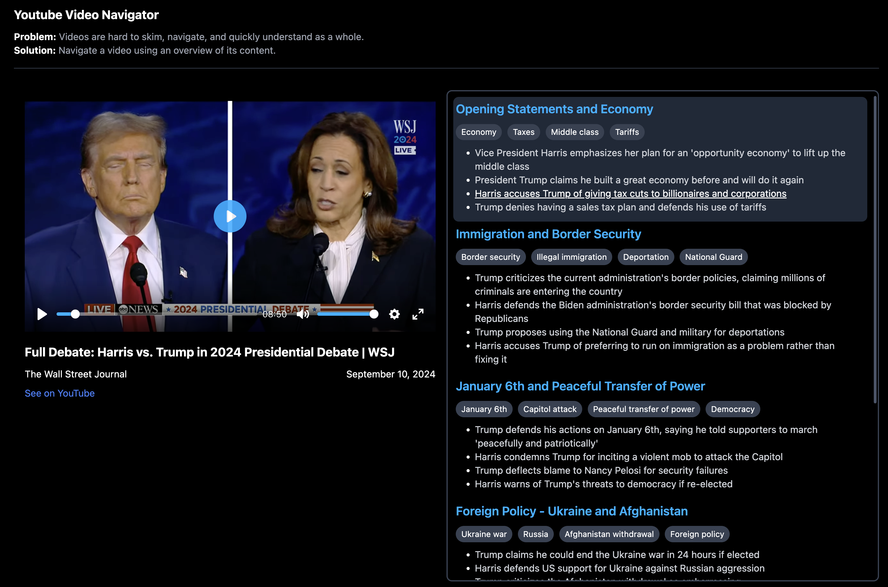

## Video Navigator

**Problem**: Videos are hard to skim, navigate, and quickly understand as a whole.
**Solution**: Navigate a video using an AI-generated overview of its content.

### Features

- **Split View**: Watch a video side by side with its overview. Full screen the video when you want.
- **Overviews**: An AI generates the overview, which is a list of chapters.
  Each chapter has a title, associations, and key points.
- **Interaction**: Clicking a chapter title or a key point takes you to the the relevant timestamp in the video. The chapter associated with current time head is highlighted.
- **Shareability**: Once a video overview is created, you can share it via a link. If you'd like to generate an overview, you may have to enter your Anthropic API key.

Inspired by Bret Victor's dynamic "[poster comic strip](https://youtu.be/uI7J3II59lc?t=934)" of a video

## Workarounds

The python youtube transcript api works locally but not in cloud environments. I think youtube blocks cloud ip addresses. As a workaround, I use proxies. This is not a paid product and is for helping others learn better, so I think it's justified.
